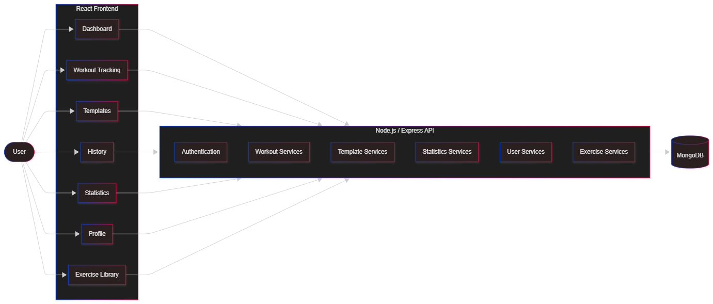
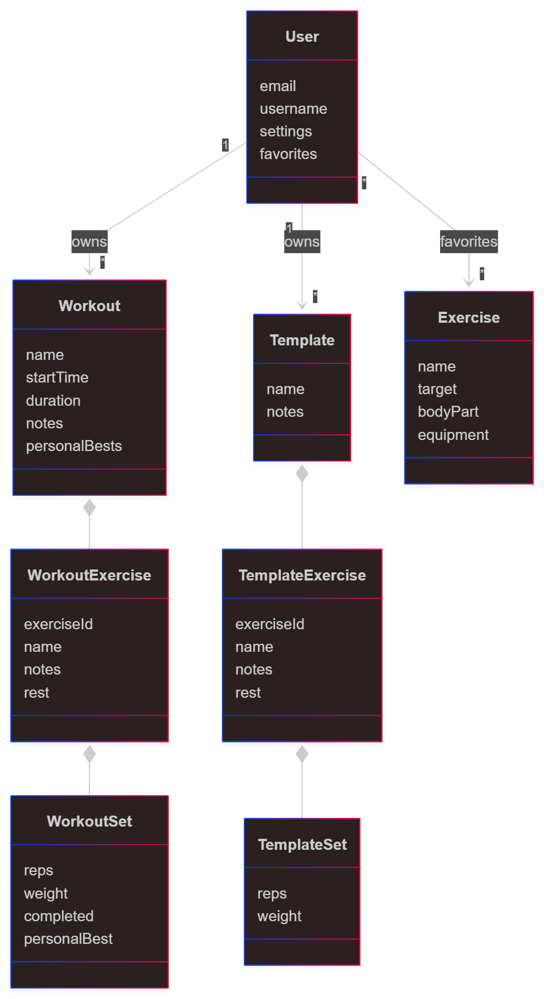

# System Architecture

## System Overview

**LifeFlow Fitness** is a full-stack fitness application that helps users track, manage, and analyze their workouts.

The system consists of a React frontend communicating with a Node.js/Express backend through a REST API. Application data is stored in MongoDB and secured using JWT-based authentication.

---

## Diagrams

The following diagrams provide complementary views of the system.

### System Architecture

The architecture diagram illustrates the high-level structure of LifeFlow Fitness and the interaction between the frontend, backend, and database layers.

It shows how user actions flow through the React application, backend services, and MongoDB persistence.

### Domain Model

The class diagram illustrates the core domain entities and their relationships.

It focuses on how users, workouts, templates, exercises, and workout data are represented within the application.

---

## Components

| Component      | Responsibility                                | Technology       |
| -------------- | --------------------------------------------- | ---------------- |
| Frontend       | User interface and user interactions          | React            |
| Backend        | REST API, business logic, and data processing | Node.js, Express |
| Database       | Data persistence and storage                  | MongoDB          |
| Authentication | User authentication and authorization         | JWT              |

---

## Key Design Decisions

### React Frontend

React was chosen because it provides a component-based architecture, rapid development workflow, and strong ecosystem support. It also offered an opportunity to gain practical experience with modern frontend development.

### Node.js / Express Backend

Node.js and Express were selected due to their simplicity, flexibility, and suitability for building REST APIs that integrate naturally with React applications.

### MongoDB Database

MongoDB provides a flexible document-based data model that works well for workout sessions, templates, exercises, and user-specific fitness data.

### JWT Authentication

JWT-based authentication enables secure stateless authentication while keeping the frontend and backend loosely coupled.

### Repository Structure

The project is organized into separate frontend, backend, deployment, and documentation repositories to improve maintainability and separation of concerns.

### Git Workflow

The project follows a feature-based Git workflow:

* `main` contains stable and deployable code
* Feature branches are used for new functionality
* Fix branches are used for bug fixes
* Refactor branches are used for code improvements
