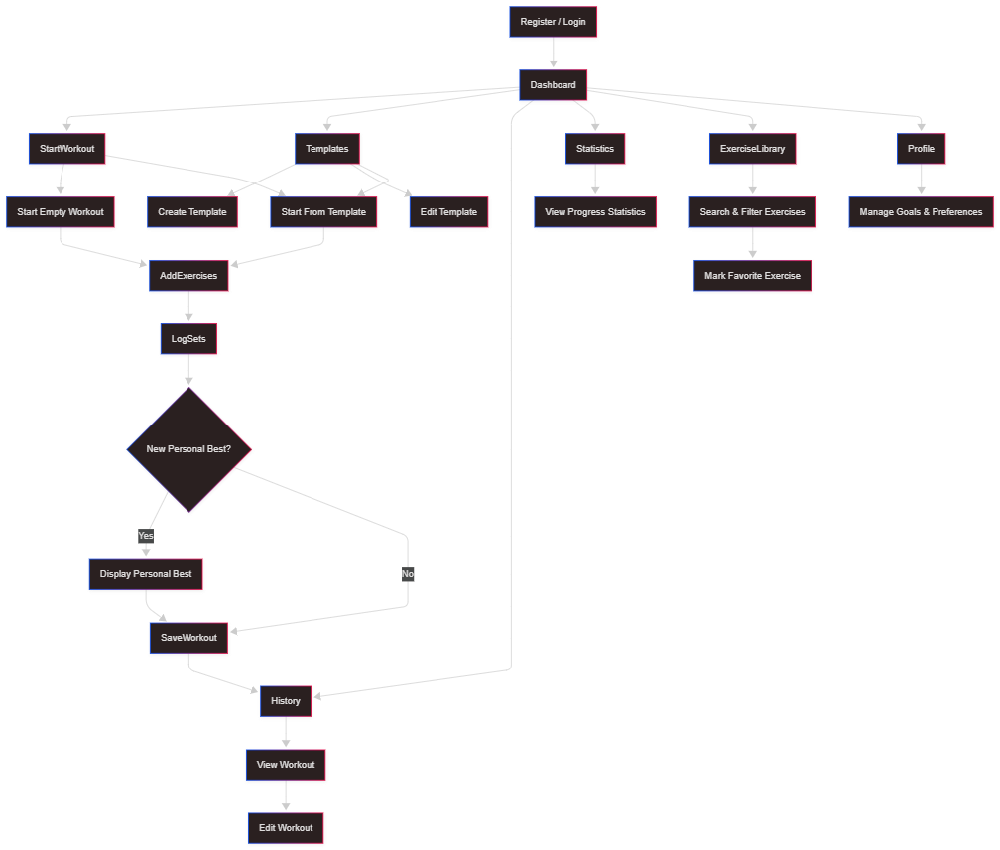

# User Journey

This document describes the primary user flow through the LifeFlow Fitness application.

---

## 1. Register or Log In

* User registers a new account or logs in to an existing account.
* After authentication, the user is redirected to the Dashboard.

The Dashboard provides:

* Welcome message
* Motivational quote
* Personal workout statistics
* Monthly workout goal progress
* Recent workouts

---

## 2. Start a Workout

The user can start a workout by:

* Creating a new empty workout
* Starting from a workout template
* Reusing a previous workout

The active workout session opens and is ready for tracking.

---

## 3. Browse Exercises

The Exercise Library allows users to:

* Search exercises by name
* Filter exercises by muscle group
* Filter exercises by equipment
* Filter favorite exercises
* Browse paginated results

Exercises can be marked as favorites and added directly to the active workout.

---

## 4. Log Workout Data

During a workout session, the user can:

* Add exercises
* Add sets
* Enter repetitions and weight
* Configure rest times
* Add exercise notes

Exercises can be added, removed, reordered, or edited throughout the session.

Previously logged values are used to simplify data entry.

---

## 5. Personal Best Detection

The system automatically detects personal bests.

When a set exceeds previous performance:

* The set is marked as a personal best
* Personal best statistics are updated
* Feedback is shown to the user

---

## 6. Complete Workout

When the workout is finished:

* Workout data is saved
* Statistics are updated
* Workout history is updated

A workout summary displays:

* Total training volume
* Total sets completed
* Total repetitions completed
* Workout duration
* Personal bests achieved

---

## 7. Workout History

Users can:

* Browse completed workouts
* View workout details
* Edit previous workouts
* Reuse previous workouts as a starting point for new sessions

Workout history provides long-term progress tracking.

---

## 8. Workout Templates

Users can create reusable workout templates.

Templates can be:

* Created
* Edited
* Deleted
* Reused

Templates help reduce repetitive setup work and speed up workout creation.

---

## 9. Statistics

The Statistics page provides insights into workout activity and performance.

Available metrics include:

* Total workouts completed
* Total training volume
* Personal best statistics
* Exercise usage statistics
* Workout frequency metrics

Statistics are generated automatically from workout history.

---

## 10. Profile & Preferences

Users can configure personal preferences including:

* Monthly workout goal
* Default rest timer duration
* Rest timer enable/disable settings

Settings persist between sessions and can be customized per workout when needed.

---

## Design Principles

LifeFlow Fitness prioritizes:

* Simplicity
* Fast workout logging
* Minimal friction
* Clear progress tracking
* Long-term motivation

Personal best tracking, workout statistics, and reusable templates are designed to encourage consistent training without overwhelming the user.

---

## Future Development

Planned functionality includes:

* Calendar and workout planning
* Achievement system
* Expanded statistics and visualizations
* Additional profile customization
* Workout recommendations
* Improved training scheduling

---

## User Journey Diagram

